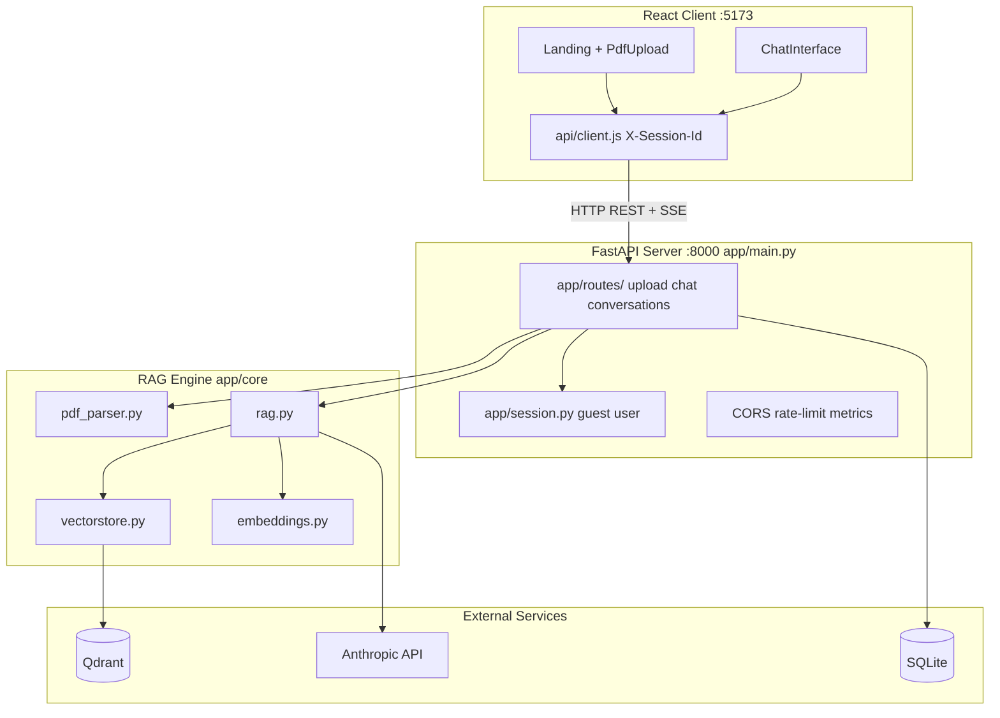
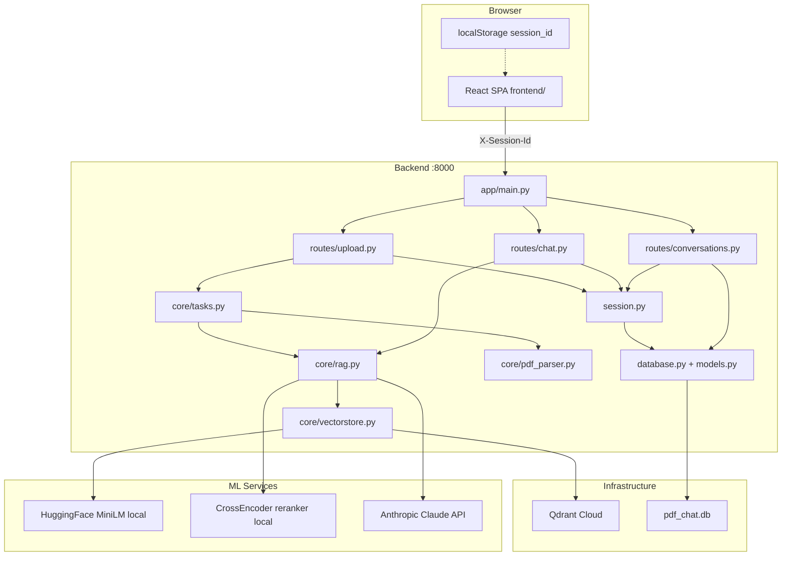
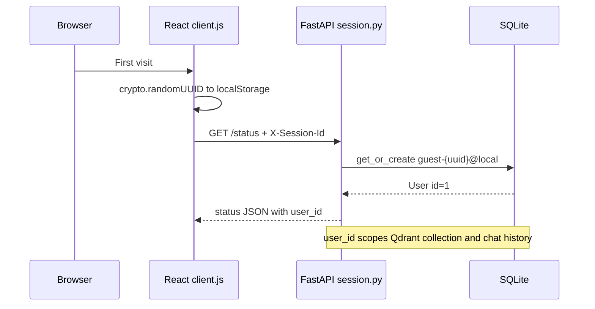
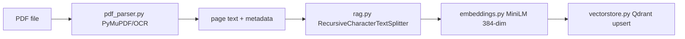
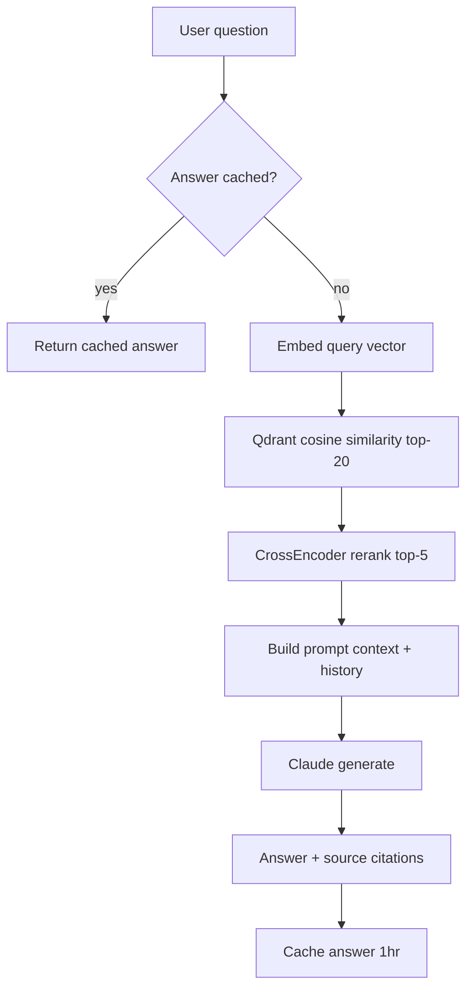
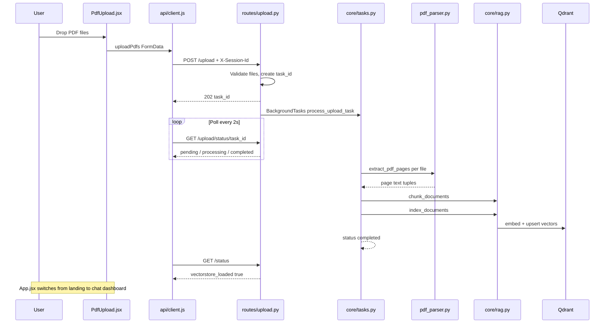
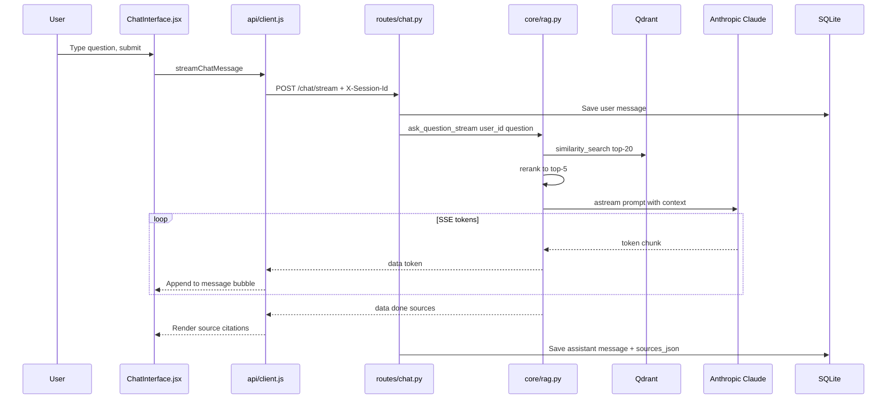
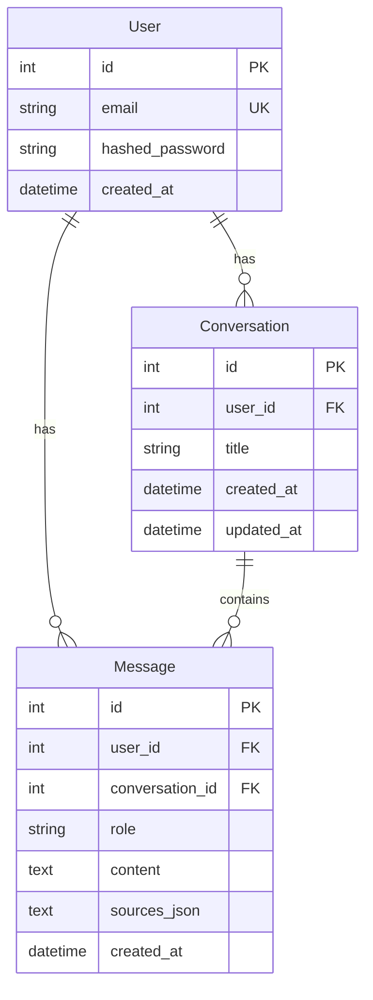

#VectorMind

**RAG-powered document Q&A** — upload PDFs, ask questions in natural language, and get answers grounded in your documents with source citations.

Built with **React + FastAPI + Qdrant Cloud + Claude**. This app is designed to **run locally** on your machine (local embeddings require more RAM than free cloud tiers provide). See [`run_locally.txt`](run_locally.txt) for startup commands.

This README is the full technical reference: architecture, RAG pipeline and client/server flow.

---

## Table of contents

1. [Overview](#overview)
2. [Tech stack](#tech-stack)
3. [Quick start](#quick-start)
4. [Project structure](#project-structure)
5. [Where FastAPI fits](#where-fastapi-fits)
6. [System architecture](#system-architecture)
7. [Session identification](#session-identification)
8. [RAG ingestion pipeline](#rag-ingestion-pipeline)
9. [RAG query pipeline](#rag-query-pipeline)
10. [Upload flow (client + server)](#upload-flow-client--server)
11. [Chat flow (client + server)](#chat-flow-client--server)
12. [Data model](#data-model)
13. [API reference](#api-reference)
14. [Configuration](#configuration)
15. [Testing](#testing)

---

## Overview

VectorMind is a **Retrieval-Augmented Generation (RAG)** application. Users upload PDF documents; the system extracts text, splits it into chunks, embeds them into a vector database, and answers questions by retrieving the most relevant passages and passing them to **Anthropic Claude** as context.

**Problem it solves:** General-purpose LLMs do not know your private documents. RAG lets you query proprietary PDFs without retraining a model — upload new files and the knowledge base updates immediately.

**Key features:**

- Landing page with drag-and-drop PDF upload
- Per-browser session isolation (no login required)
- Async background indexing with progress polling
- Streaming chat responses (Server-Sent Events)
- Source citations (filename, page, chunk preview)
- CORS, rate limiting, structured logging, Prometheus metrics

**Runs locally only** — not hosted online. The frontend shows a notice on the landing page; use `run_locally.txt` to start backend + frontend.

---

## Tech stack

| Layer | Technology | Role |
|-------|------------|------|
| **Frontend** | React 19 + Vite | Landing page, drag-drop upload, streaming chat UI |
| **API server** | FastAPI + Uvicorn | REST + SSE endpoints (`app/main.py`) |
| **LLM** | Anthropic Claude (`claude-sonnet-4-6`) | Answer generation via `langchain-anthropic` |
| **Embeddings** | HuggingFace `all-MiniLM-L6-v2` (local, 384-dim) | Semantic vectors for chunks and queries |
| **Vector DB** | Qdrant Cloud | Per-user collections, cosine similarity search |
| **Reranker** | CrossEncoder `ms-marco-MiniLM-L-6-v2` | Re-score top-20 vector hits down to top-5 |
| **PDF parsing** | PyMuPDF + PyPDF2 fallback + Tesseract OCR | Text extraction from scanned pages |
| **Chat history** | SQLite + SQLAlchemy | Persistent conversations and messages |
| **Orchestration** | LangChain | Text splitting, conversation memory, LLM wrapper |

---

## Quick start

### Prerequisites

- Python 3.12+
- Node.js 18+
- [Anthropic API key](https://console.anthropic.com/)
- [Qdrant Cloud](https://cloud.qdrant.io) cluster (free tier works)

### Steps

See [`run_locally.txt`](run_locally.txt) for copy-paste commands. Summary:

**1. Install backend dependencies**

```bash
pip install -r requirements.txt
```

**2. Configure environment**

```bash
cp .env.example .env
```

Edit `.env` with your keys:

```env
ANTHROPIC_API_KEY=your_anthropic_api_key
QDRANT_URL=https://your-cluster-id.region.cloud.qdrant.io:6333
QDRANT_API_KEY=your_qdrant_api_key
CORS_ORIGINS=http://localhost:5173,http://127.0.0.1:5173
```

**3. Start the backend** (project root)

```bash
uvicorn app.main:app --host 0.0.0.0 --port 8000 --reload
```

**4. Start the frontend** (new terminal)

```bash
cd frontend
npm install
npm run dev
```

**5. Open** http://localhost:5173

The API entry point is **`app/main.py`**. Uvicorn loads the FastAPI `app` object directly.

### Frontend env (optional)

`frontend/.env` can set `VITE_API_BASE_URL=http://localhost:8000` — defaults to localhost if unset.

---

## Project structure

```
pdf_chat/
├── app/
│   ├── main.py                 # FastAPI app factory, middleware, router registration
│   ├── config.py               # Settings from .env (pydantic-settings)
│   ├── session.py              # X-Session-Id → guest User (per-browser isolation)
│   ├── database.py             # SQLAlchemy engine, init_db()
│   ├── models.py               # User, Conversation, Message tables
│   ├── routes/
│   │   ├── upload.py           # POST /upload, GET /upload/status/{task_id}
│   │   ├── chat.py             # POST /chat, /chat/stream, GET /status
│   │   ├── conversations.py    # CRUD for chat threads + message history
│   │   └── health.py           # GET /health
│   └── core/                   # RAG engine (no HTTP knowledge)
│       ├── pdf_parser.py       # PDF text extraction + OCR fallback
│       ├── rag.py              # Chunking, retrieval, reranking, LLM calls
│       ├── vectorstore.py      # Qdrant integration
│       ├── embeddings.py       # HuggingFace embedding singleton
│       ├── cache.py            # Answer TTL cache (1 hour)
│       └── tasks.py            # Background upload job state
├── frontend/
│   └── src/
│       ├── App.jsx             # Landing page + chat dashboard
│       ├── api/client.js       # HTTP client, session ID, SSE parsing
│       └── components/
│           ├── PdfUpload.jsx   # Drag-drop upload (hero + sidebar variants)
│           ├── ChatInterface.jsx
│           └── StatusBadge.jsx
├── tests/                      # pytest suite
├── scripts/eval_rag.py         # Golden-set RAG evaluation
├── run_locally.txt             # Commands to start the full app
├── .env.example                # Environment variable template
└── requirements.txt
```

**Rule of thumb:** `app/routes/` handles HTTP; `app/core/` handles AI/document logic. The React app never talks to Qdrant or Claude directly — everything goes through FastAPI.

---

## Where FastAPI fits

FastAPI is **the backend server**. It is not a separate layer sitting beside another server — `app/main.py` creates the application, registers routes, applies middleware, and on startup initializes SQLite.



**What FastAPI does:**

1. Receives HTTP requests from the React client
2. Resolves the browser session to a `User` row (`app/session.py`)
3. Validates input (file size, question not empty, etc.)
4. Persists conversations/messages to SQLite
5. Delegates document AI work to `app/core/`
6. Returns JSON or SSE streams

**What FastAPI does not do:** embedding, vector search, PDF parsing, or LLM calls — those live in `app/core/`.

---

## System architecture



| Component | Port / path | Responsibility |
|-----------|-------------|----------------|
| React (Vite) | `:5173` | UI, session ID, API calls |
| FastAPI | `:8000` | HTTP API, auth session, orchestration |
| Qdrant Cloud | HTTPS | Vector storage per user (`pdf_chat_user_{id}`) |
| SQLite | `pdf_chat.db` | Users, conversations, messages |
| Claude | HTTPS API | Text generation |

---

## Session identification

There is no login or JWT. Each browser generates a UUID stored in `localStorage` and sends it on every request as the `X-Session-Id` header. The backend creates a guest `User` row on first visit.



- **Same browser** = same session = same documents and conversations
- **Incognito / cleared storage** = new session = empty state
- **Not production-secure:** anyone with a session UUID could access that guest's data (acceptable for local/demo)

---

## RAG ingestion pipeline

What happens when a user uploads PDFs — from file bytes to searchable vectors.



### Step-by-step

| Step | Module | What happens |
|------|--------|--------------|
| **1. Upload** | `routes/upload.py` | Client sends `multipart/form-data`. Server validates PDF type, per-file size (50 MB), total size (200 MB), max 10 files. Returns `202 Accepted` with `task_id`. |
| **2. Background job** | `core/tasks.py` | FastAPI `BackgroundTasks` runs `process_upload_task`. Status tracked in-memory: `pending` → `processing` → `completed` / `failed`. |
| **3. Extract** | `core/pdf_parser.py` | PyMuPDF extracts text per page. If a page has &lt; 50 chars, Tesseract OCR runs on a rendered image. PyPDF2 is the fallback if PyMuPDF yields nothing. |
| **4. Chunk** | `core/rag.py` | `RecursiveCharacterTextSplitter` splits text into ~**1000-character** chunks with **200-character overlap**. Each chunk gets metadata: `filename`, `page`, `chunk_index`. |
| **5. Embed** | `core/embeddings.py` | HuggingFace `all-MiniLM-L6-v2` converts each chunk to a **384-dimensional** vector. Runs locally — no embedding API cost. |
| **6. Store** | `core/vectorstore.py` | Vectors upserted into Qdrant collection `pdf_chat_user_{user_id}` with cosine distance. Payload stores `content` + metadata for retrieval. |

**Chunk overlap** ensures sentences split across chunk boundaries are still findable by semantic search.

---

## RAG query pipeline

What happens when a user asks a question — semantic search through answer generation.



### Semantic search explained

Traditional search matches **keywords**. Semantic search matches **meaning**:

1. The question is embedded into the same 384-dim vector space as document chunks
2. Qdrant finds the **20 nearest neighbors** by cosine similarity
3. A **CrossEncoder reranker** re-scores those 20 pairs `(question, chunk)` and keeps the best **5**

This two-stage retrieve-then-rerank pattern is common in production RAG: vector search is fast but approximate; the cross-encoder is slower but more accurate.

**Code path:** `retrieve_context()` in `rag.py` → `vectorstore.similarity_search(k=20)` → `rerank_documents(top_k=5)`.

### Prompt construction

The top-5 chunks are formatted as:

```
[Source 1: filename.pdf, page 3]
<chunk text>
```

Plus optional conversation history (last 6 messages from LangChain `ConversationBufferMemory`) and the user's question. System instructions in `RAG_SYSTEM_INSTRUCTIONS` enforce professional formatting, no emojis, and no raw source dumps in the answer body.

### Caching and memory

| Mechanism | Location | Lifetime |
|-----------|----------|----------|
| Answer cache | `core/cache.py` | 1 hour TTL, keyed by `user_id + question` |
| LangChain memory | `rag.py` `_user_memories` | In-process; lost on server restart |
| Chat history | SQLite `messages` table | Persistent across restarts |

---

## Upload flow (client + server)



---

## Chat flow (client + server)



Non-streaming `POST /chat` follows the same retrieval path but returns a single JSON response via `ask_question()`.

---

## Data model

SQLite schema (`app/models.py`):



Guest users use emails like `guest-{uuid}@local`. The `user_id` foreign key scopes both SQLite rows and the Qdrant collection name.

**In-memory only (not in DB):**

- `upload_tasks` dict in `tasks.py` — upload job progress
- `_user_memories` dict in `rag.py` — LangChain conversation buffer
- `_answer_cache` dict in `cache.py` — recent Q&A pairs

---

## API reference

| Method | Path | Auth | Description |
|--------|------|------|-------------|
| `GET` | `/` | None | API root + endpoint list |
| `GET` | `/health` | None | Health check + uptime |
| `GET` | `/status` | `X-Session-Id` | Vectorstore ready, document count |
| `POST` | `/upload` | `X-Session-Id` | Upload PDFs (async, returns `task_id`) |
| `GET` | `/upload/status/{task_id}` | `X-Session-Id` | Poll upload progress |
| `POST` | `/chat` | `X-Session-Id` | Ask question (JSON response) |
| `POST` | `/chat/stream` | `X-Session-Id` | Ask question (SSE stream) |
| `GET` | `/conversations` | `X-Session-Id` | List conversations |
| `POST` | `/conversations` | `X-Session-Id` | Create conversation |
| `GET` | `/conversations/{id}/messages` | `X-Session-Id` | Get message history |
| `GET` | `/metrics` | None | Prometheus metrics |

### Request examples

**Upload:**

```
POST /upload
X-Session-Id: <uuid>
Content-Type: multipart/form-data
files: [pdf1, pdf2, ...]
```

**Chat stream:**

```
POST /chat/stream
X-Session-Id: <uuid>
Content-Type: application/json

{"question": "What is NLP?", "conversation_id": 1}
```

**SSE response format:**

```
data: {"token": "Natural "}
data: {"token": "Language "}
data: {"done": true, "sources": [{"content": "...", "metadata": {"filename": "...", "page": 3}}]}
```

### Rate limits

| Endpoint | Limit |
|----------|-------|
| `/chat`, `/chat/stream` | 20 requests / minute |
| `/upload` | 5 requests / minute |

---

## Configuration

All settings in `app/config.py`, overridable via `.env`:

| Variable | Default | Description |
|----------|---------|-------------|
| `ANTHROPIC_API_KEY` | `""` | Required for Claude |
| `QDRANT_URL` | `http://localhost:6333` | Qdrant URL (use Cloud URL with `:6333` for local dev) |
| `QDRANT_API_KEY` | `""` | Required for Qdrant Cloud |
| `QDRANT_COLLECTION_PREFIX` | `pdf_chat` | Collection name prefix |
| `DATABASE_URL` | `sqlite:///./pdf_chat.db` | SQLAlchemy connection |
| `CORS_ORIGINS` | `http://localhost:5173,...` | Allowed frontend origins |
| `CLAUDE_MODEL` | `claude-sonnet-4-6` | Anthropic model ID |
| `CLAUDE_MAX_TOKENS` | `2048` | Max response tokens |
| `CLAUDE_TEMPERATURE` | `0.2` | LLM temperature |
| `CHUNK_SIZE` | `1000` | Characters per chunk |
| `CHUNK_OVERLAP` | `200` | Overlap between chunks |
| `RETRIEVAL_TOP_K` | `20` | Vector search candidates |
| `RERANK_TOP_K` | `5` | Chunks sent to Claude |
| `EMBEDDING_MODEL` | `all-MiniLM-L6-v2` | HuggingFace model |
| `RERANKER_MODEL` | `ms-marco-MiniLM-L-6-v2` | CrossEncoder model |


---

## Testing

```bash
pytest tests/ -v
```

Tests mock Qdrant and use an in-memory SQLite database. Session headers are sent via `X-Session-Id`.

Optional dev dependencies:

```bash
pip install -r requirements-dev.txt
```

---

## License

MIT
